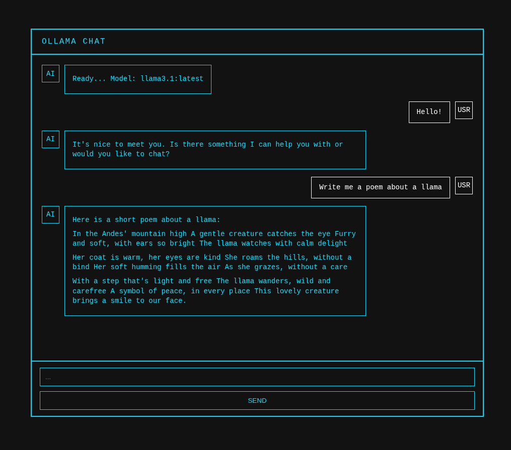
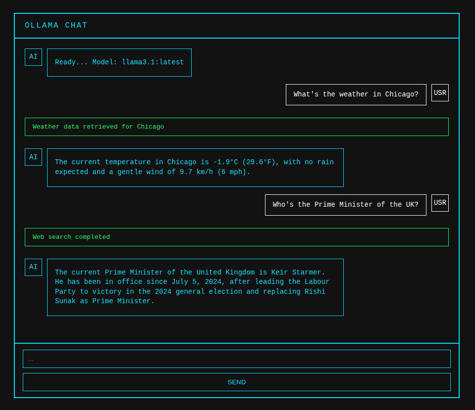
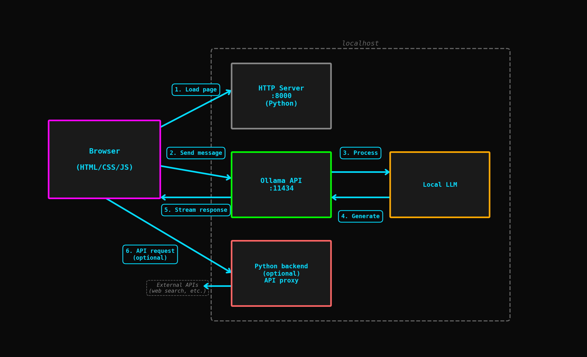

# A web interface for local AI models

A stylish web-based chat interface for Ollama for your local network with integrated web, weather, and wikipedia search.

## Demo

### Chat


### Web search


## Architecture

The browser loads static HTML/CSS/JS files from a Python HTTP server which talks with the Ollama API. Ollama forwards messages to a locally-running LLM, which generates tokens which stream back through the chain to appear in the browser. A seperate Python backend server enables API calls for features like web search.




## Quick start

### 1. Install Ollama and download a model

First, you need to install Ollama and download at least one language model:

```bash
# Install Ollama (Linux/macOS)
curl -fsSL https://ollama.ai/install.sh | sh

# Download a model (browse https://ollama.ai/search)
ollama pull llama3.1:latest

# Verify installation
ollama list
```

**Note:** Ollama must be running for the chat interface to work. The application defaults to using `llama3.1:latest` but you can change this in the configuration.

### 2. Start services

**Quick start (recommended):**
```bash
./start-all.sh  # Sets up environment and starts all services
```

**Manual start (more fun):**

*Note: Each command needs to run continuously. Use separate terminals, use detached sessions with `screen` or similar, or run with `&` to background (as shown).*

```bash
# Setup logs directory
mkdir logs

# Ollama (if not already running)
OLLAMA_HOST=0.0.0.0:11434 ollama serve > logs/ollama.log 2>&1 &

# Web server
cd frontend && python3 -m http.server 8000 --bind 0.0.0.0 > ../logs/http-server.log 2>&1 &

# ---------------------------------------
# Optional Python backend for web search:
# ---------------------------------------

# Create Python & activate a virtual environment 
python3 -m venv venv
source venv/bin/activate

# Upgrade pip & install dependencies 
pip install --upgrade pip
pip install -r backend/requirements.txt

# Start the search proxy
python3 backend/search-proxy.py > logs/search-proxy.log 2>&1 &
```

### 3. Open chat

Navigate to:

`http://localhost:8000/chat.html`

or

`http://<LOCAL_IP>:8000/chat.html`

if accessing from another device on your network where `LOCAL_IP` is the IP address of the device running `ollama-chat`. 

### 4. Stop services

**Quick stop (recommended):**
```bash
./stop-all.sh  # Will prompt you to stop Ollama
```

**Manual stop:**

```bash
# Stop HTTP server
pkill -f "python.*http.server 8000"

# Stop search proxy
pkill -f "search-proxy.py"

# Stop Ollama
pkill ollama
```

