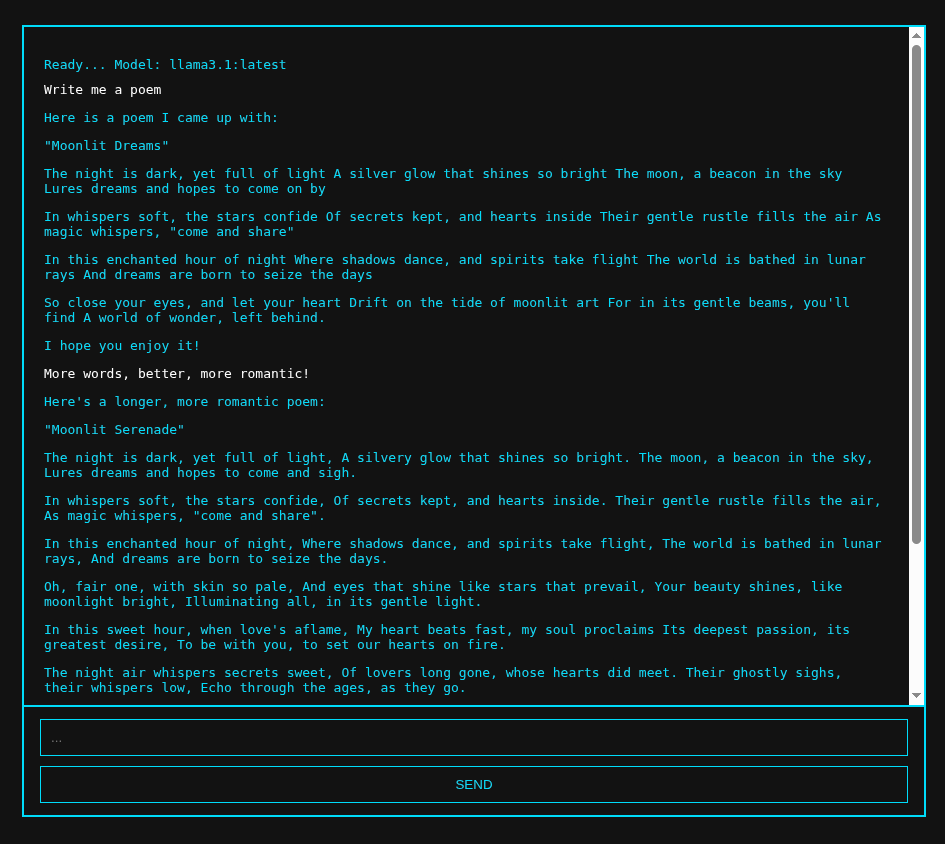

# Local AI interface with web search

A simple template for a web-based chat interface for local open source Ollama models.

This is a fun way to interact with LLMs privately on your local network!

## Demo

## Basic AI interaction


## Quick start

### 1. Install Ollama and download a model

First, you need to install Ollama and download at least one language model:

```bash
# Install Ollama (Linux/macOS)
curl -fsSL https://ollama.ai/install.sh | sh

# Download a model (e.g., Llama 3.1)
ollama pull llama3.1:latest

# Verify installation
ollama list
```

**Note:** Ollama must be running for the chat interface to work. The application defaults to using `llama3.1:latest` but you can change this in the configuration. Larger models require more compute! 

### 2. Start services

**Quick start (recommended):**
```bash
./start-all.sh  # Sets up environment and starts all services
```

**Manual start (more fun):**

*Note: Each command needs to run continuously. Use separate terminals, use detached sessions with `screen` or similar, or run with `&` to background (as shown).*

```bash
# Setup logs directory
mkdir logs

# Ollama (if not already running)
OLLAMA_HOST=0.0.0.0:11434 ollama serve > logs/ollama.log 2>&1 &

# Web server
cd frontend && python3 -m http.server 8000 --bind 0.0.0.0 > ../logs/http-server.log 2>&1 &
```

### 3. Open chat

Navigate to: `http://localhost:8000/osiris-chat.html`

### 4. Stop services

**Quick stop (recommended):**
```bash
./stop-all.sh  # Will prompt you to stop Ollama
```

**Manual stop (more fun):**

```bash
# Stop HTTP server
pkill -f "python.*http.server 8000"

# Stop Ollama
pkill ollama
```

