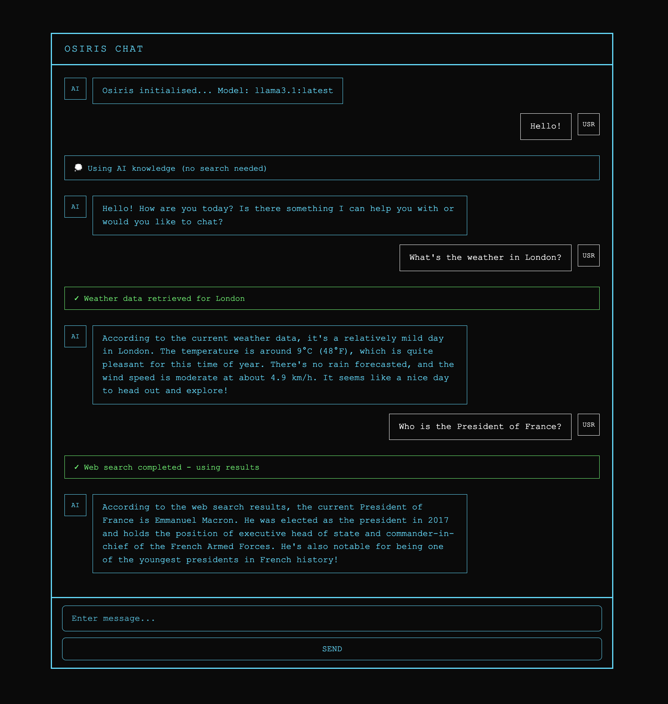

# Local LLM UI with web search

A web-based chat interface for local Ollama models with integrated real-time web search and weather APIs.

Created mostly through vibe-coding with *Claude Sonnet 4*.

## Features

- 💬 Chat with local Ollama models
- 🔍 Real-time web search via DuckDuckGo
- 🌤️ Weather data via OpenMeteo API
- 📚 Wikipedia fallback for encyclopedic queries
- ✅ Clear visual indicators showing when search is used vs. AI knowledge
- 🎨 Clean sci-fi terminal-style UI



## Quick start

### 1. Install Ollama and download a model

First, you need to install Ollama and download at least one language model:

```bash
# Install Ollama (Linux/macOS)
curl -fsSL https://ollama.ai/install.sh | sh

# Download a model (e.g., Llama 3.1)
ollama pull llama3.1:latest

# Verify installation
ollama list
```

**Note:** Ollama must be running for the chat interface to work. The application defaults to using `llama3.1:latest` but you can change this in the configuration.

### 2. Setup environment

```bash
./setup-venv.sh
```

Creates virtual environment and installs dependencies (aiohttp, beautifulsoup4, lxml).

### 3. Start services

**Development (manual):**

*Note: Each command below needs to run continuously. Use separate terminals or run with `&` to background.*

```bash
# Terminal 1: Search proxy
venv/bin/python3 search-proxy.py

# Terminal 2: Web server
python3 -m http.server 8000 --bind 0.0.0.0

# Terminal 3: Ollama (if not already running)
ollama serve
```

*Alternative: Run in background with logs:*
```bash
venv/bin/python3 search-proxy.py &
python3 -m http.server 8000 --bind 0.0.0.0 &
ollama serve &
```

**Production (systemd, Linux only):**
```bash
./install-systemd.sh
```

**Quick start (all-in-one, development):**
```bash
./start-all.sh  # Sets up environment and starts all services
```

### 4. Open chat

Navigate to: `http://localhost:8000/html/osiris-chat.html`

Or from network: `http://YOUR_IP:8000/html/osiris-chat.html`

## Understanding Search Indicators

The UI shows clear status messages:

- **✓ Web search completed** (green) - Used real web data
- **✓ Weather data retrieved** (green) - Got current weather
- **Using AI knowledge** (cyan) - No search needed
- **✗ Search failed** (red) - API error, using AI fallback

## Configuration

### Change Ollama model

Edit `html/osiris-chat.html`:
```javascript
const MODEL_NAME = 'llama3.1:latest';
```

### Use remote services

Add URL parameters:
```
# Remote Ollama
?ollama=http://192.168.1.50:11434

# Remote search proxy
?search=http://192.168.1.50:8001
```

## How it works

**Automatic Query Detection:**

1. **Weather** → OpenMeteo API
   - "weather in Paris", "temperature in Tokyo"

2. **Current Events** → DuckDuckGo web search
   - "who is the president", "what happened today"

3. **Encyclopedic** → Wikipedia fallback
   - "what is quantum physics"

4. **General** → AI knowledge only
   - "tell me a joke", "explain this concept"

## Management

**Quick commands:**
```bash
# Start everything (development mode)
./start-all.sh

# Stop all services
./stop-all.sh
```

**Check service status:**
```bash
sudo systemctl status search-mcp
sudo journalctl -u search-mcp -f
```

**Test search proxy:**
```bash
curl -X POST http://localhost:8001/context \
  -H "Content-Type: application/json" \
  -d '{"prompt":"weather in London"}'
```

## Requirements

- Ollama (v0.12.10+)
- Python 3.10+
- systemd (optional, for persistent services)

## Project Structure

```
osiris-chat/
├── html/
│   └── osiris-chat.html      # Web UI
├── systemd/
│   ├── search-mcp.service    # Search proxy service
│   └── osiris-http.service   # Web server service
├── search-proxy.py           # Search/weather API proxy
├── pyproject.toml            # Python dependencies
├── setup-venv.sh            # Environment setup
├── start-all.sh             # Start all services (development)
├── install-systemd.sh       # Install services
└── stop-all.sh              # Stop all services

```

## Troubleshooting

**Check what's running:**
```bash
lsof -i :8000  # HTTP server
lsof -i :8001  # Search proxy  
lsof -i :11434 # Ollama
```

**View logs:**
```bash
# Search proxy logs
sudo journalctl -u search-mcp -f

# Follow all Osiris services
sudo journalctl -u search-mcp -u osiris-http -f
```

**Common Ollama commands:**
```bash
ollama list                    # List installed models
ollama pull llama3.1:latest   # Download a model
curl http://localhost:11434/api/version  # Check Ollama is running
```

## Security Notes

For production deployment beyond a trusted LAN:
- Use a reverse proxy (nginx) with HTTPS
- Add authentication (basic auth or OAuth)
- Configure firewall rules
- Set OLLAMA_ORIGINS environment variable

## License

MIT

---
Generated by the maintenance script on demand.
